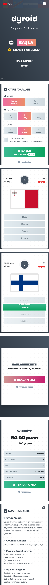

# Dyroid Bayrak Bulmaca

Kullanıcının ülke bayrağını tahmin ettiği küçük bir web oyunu.  
JavaScript ile dinamik olarak çalışır, tarayıcı dilini kullanmak ve oyuncuların puanlarını "Lider Tablosu"na kaydedebilmesini sağlamak amacıyla PHP kullanılmıştır.

## Özellikler
- Rastgele bayrak seçimi
- Puan sistemi
- Zorluk ayarı ve zorluğa göre değişen puan çarpanı
- Tarayıcı diline göre otomatik çeviri
- Basit ve mobil uyumlu tasarım
- Ses efektleri

## Kullanılan Teknolojiler
- HTML  
- CSS  
- JavaScript  
- PHP

## Çalıştırma
Projeyi yerel sunucuda çalıştırmak için;

1. `htdocs` içine klasörü kopyala
2. Tarayıcıdan `https://localhost/dyroid/` adresine git  
3. Oyuna başla 🎯

## Ekran Görüntüleri

